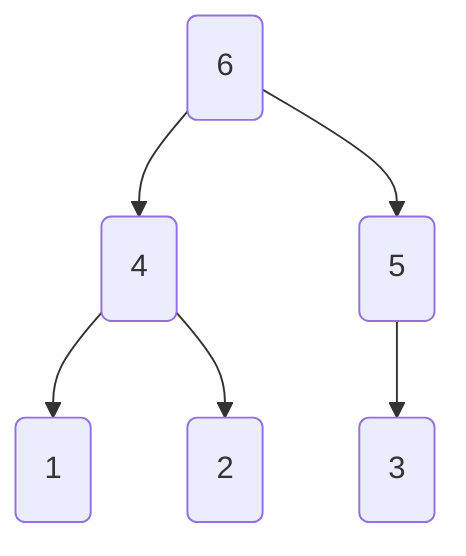
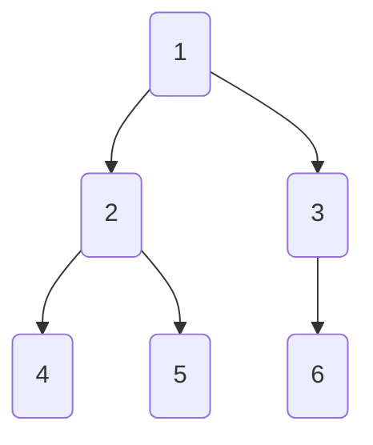
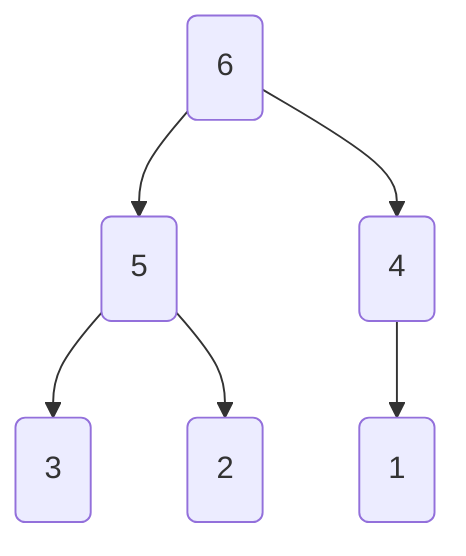
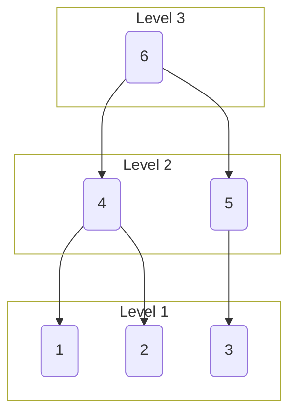
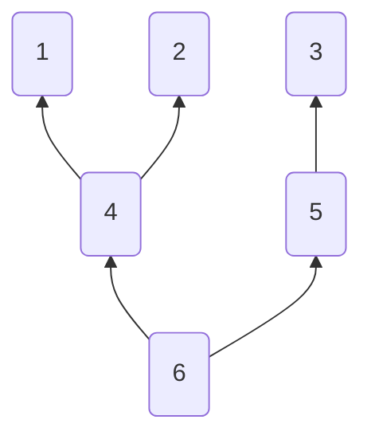
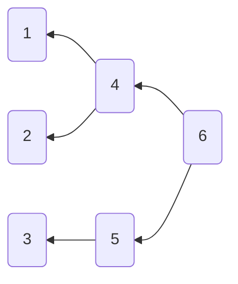

# enary

Provided a leaf capacity and a branching factor, generate an n-ary tree for visualizations

> Originally a gist in <https://gist.github.com/miraclx/9fc4639a6104ad6ec40fc52753ac8e6a>

## Usage

```console
Generate an n-ary tree under specific constaints

Usage: enary [opts] <leaves> <branches>

Options:
  -a              Ascending
  -r              Reverse
  -l              Show level outlines
  -t <spec>       Table representation (default: `h`)
                  - `v` for vertical   (`v+` to invert)
                  - `h` for horizontal (`h+` to invert)
  --raw           Print raw tree to stdout, do not write to file
  -o <file>       Output file (default: `tree.md`)
  --debug         Print all nodes
  -h, --help      Show this help
```

### Examples

#### Basic

```console
$ enary 3 2
Tree written to `tree.md`
------------------------------
View interactive diagram at:
  - https://mermaid.live/view#pako:eNo9y70KwjAYheFb-TiDpFCH_g4ZHMQ70EmyfLTpDzRJickgpfcuYur28nDOhs71GhKj53Wix1VZIiJbiCJLWYryyEpUR9aizuh8vpAt6ES2TNyIJnGVpBVtkvo7bJDDaG947iGxKYRJG60gFXo9cFyCwo4cHIO7v20HGXzUObyL4wQ58PLSOeLac9C3mUfP5q8r26dz5nfZP5KVPvs
------------------------------
```



[`tree.md`](examples/03x2.md)

#### Ascending Order

```console
$ enary 3 2 -a
Tree written to `tree.md`
------------------------------
View interactive diagram at:
  - https://mermaid.live/view#pako:eNo9y70KwjAYheFb-TiDpFCH_g4ZHMQ70EmyfLTpDzRJickgpfcuYur28nDOhs71GhKj53Wix1VZIiJbizpL2YjmyFa0R5aizOh8vpCt6US2SVyJKnGbpBBFkvI7rJDDaG947iGxKYRJG60gFXo9cFyCwo4cHIO7v20HGXzUObyL4wQ58PLSOeLac9C3mUfP5q8r26dz5nfZP5lpPwA
------------------------------
```



[`tree.md`](examples/03x2:ascending.md)

#### Reversed

```console
$ enary 3 2 -r
Tree written to `tree.md`
------------------------------
View interactive diagram at:
  - https://mermaid.live/view#pako:eNo9y70KwjAYheFb-TiDpFCH_g4ZHMQ70EmyfLTpDzRJickgpfcuYur28nDOhs71GhKj53Wix1VZIiJbiSpLWYryyEIURzaiyeh8vpCt6ES2TFyLOnGRpBVtkuY7rJHDaG947iGxKYRJG60gFXo9cFyCwo4cHIO7v20HGXzUObyL4wQ58PLSOeLac9C3mUfP5q8r26dz5nfZP5NOPvs
```



[`tree.md`](examples/03x2:reversed.md)

#### Level Highlights

```console
$ enary 3 2 -l
Tree written to `tree.md`
------------------------------
View interactive diagram at:
  - https://mermaid.live/view#pako:eNptjTFvwyAQRv_K6YaKSM4A2BkYOkQduyVTSwcaztgSBsuGSlGU_16lppaadPt4J9674ClaQoVuMmMHx70OAHP-XJ6Ov2t8pS_ywDV-3G4Aczp7Aseh7b1XIQZaeOCMb8oUTPxOyeTPpGD_usXqFvdu8eCuWb2B7fYZAocnCKLghjUFy38bcm3I-4Z8aOzYrsjqW6MpRqxwoGkwvUWFF42po4E0Ko2WWpN90njFCk1O8XAOJ1RpylThFLPrULXGz1RhHq1J9NIbN5lhpaMJbzEOy5frNxiaeMQ
```



[`tree.md`](examples/03x2:levels.md)

#### Horizontal, Bottom-up

```console
$ enary 3 2 -t h+
Tree written to `tree.md`
------------------------------
View interactive diagram at:
  - https://mermaid.live/view#pako:eNo9y70KwjAYheFb-TiDpFCH_g4ZHMQ70EmyfLTpDzRJickgpfcuYur28nDOhs71GhKj53Wi60NZIiJbiCJLWYryyEpUR9aizuh8vpAt6ES2TNyIJnGVpBVtkvo7bJDDaG947iGxKYRJG60gFXo9cFyCwo4cHIO7v20HGXzUObyL4wQ58PLSOeLac9C3mUfP5q8r26dz5nfZP5KDPvs
```



[`tree.md`](examples/03x2:inverted.md)

#### Vertical, Right-left

```console
$ enary 3 2 -t v+
Tree written to `tree.md`
------------------------------
View interactive diagram at:
  - https://mermaid.live/view#pako:eNo9yzsLwjAYheG_8nEGSaEOvQ4ZnByddJMsH216gSYpMRmk9L-LmLq9PJyzoXO9hsToeZ3oflOWiMgWoshSlqI8shLVkbWoMzqfL2QLOpEtEzeiSVwlaUWbpP4OG-Qw2huee0hsCmHSRitIhV4PHJegsCMHx-Aeb9tBBh91Du_iOEEOvLx0jrj2HPR15tGz-evK9umc-V32D5jrPwM
```



[`tree.md`](examples/03x2:vertical:inverted.md)

#### Print

```console
$ enary 3 2 --raw
graph TB
    n1(1)
    n2(2)
    n3(3)
    n4(4) --> n1 & n2
    n5(5) --> n3
    n6(6) --> n4 & n5
------------------------------
View interactive diagram at:
  - https://mermaid.live/view#pako:eNo9y70KwjAYheFb-TiDpFCH_g4ZHMQ70EmyfLTpDzRJickgpfcuYur28nDOhs71GhKj53Wix1VZIiJbiCJLWYryyEpUR9aizuh8vpAt6ES2TNyIJnGVpBVtkvo7bJDDaG947iGxKYRJG60gFXo9cFyCwo4cHIO7v20HGXzUObyL4wQ58PLSOeLac9C3mUfP5q8r26dz5nfZP5KVPvs
------------------------------
```

## License

[Apache 2.0][license] © **Miraculous Owonubi** ([@miraclx][author-url]) \<<omiraculous@gmail.com>\>

[license]:  LICENSE "Apache 2.0 License"
[author-url]: https://github.com/miraclx
