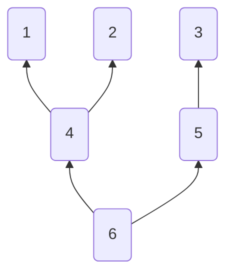

# Generated Tree

<details>
<summary> Parameters </summary>

- Leaves: 3
- Branches: 2
- Order: Descending
- Level Outlines: no
- Table Representation: Horizontal (bottom-up)

```console
enary 3 2 -t h+ -o examples/03x2:inverted.md
```

</details>

<div align="center">

[Interactive View](https://mermaid.live/view#pako:eNo908tq3EAQBdBfEb0I1zAG1aP1WngR8gfJKsxGeOQZgyUNirQIxv8epqsqu-IW0unbQp_pdb1MaUjXbbzfql_fz0tVLQR6KgODbRCIDQq1ISPb0KCxoUVrQ4fOhh69DVSDah8J5G8nBvn7SUAukILcoAxyhRqQO9SCXKIO5Bb1INe4BrvGBI4uDHaNBewaK9g1zmDXuAG7xi24faqen1-qhapv1cIWd-DOY3nEanEP7j3Oj7ix66shtcftI-4sJgh53D9iqi1nCIdZUDJVBCKxKCyZKwrRWBSYXM6QHItCk9sNpIlFwdnxFhKF2Ro73kGiMhecHe8hUZoLzoZrDY3aXHA2XAkaxbngYrgyNJpLwcVwFWg0l4KL4arQaC4FF8czNJpLwcXxBhrNpbeohUZnrcvnJFt00OisXBZiix4anVXLItt_USNHZ7WTZEKOtlpOonaSzMjRVss1ZLuGLMjRNpdryJxOaZ62eXy_pCF9ntN-m-bpnIZzukxv4_Gxn9NXOqXx2Neff5fXNOzbMZ3Sth7XWxrexo8_0ykd98u4Tz_ex-s2zv_T-7j8XtfZHvn6ByNE-do)



</div>
