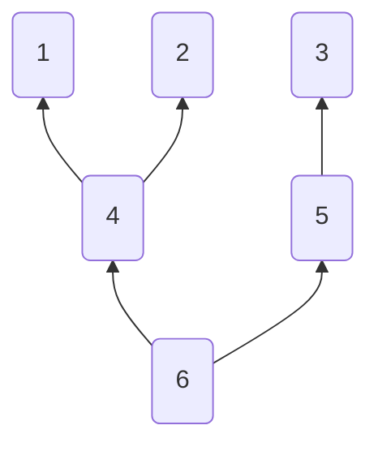

# Generated Tree

<details>
<summary> Parameters </summary>

- Leaves: 3
- Branches: 2
- Order: Descending
- Level Outlines: no
- Table Representation: Horizontal (bottom-up)

```console
enary 3 2 -t h+ -o examples/03x2:inverted.md
```

</details>

<div align="center">

[Interactive View](https://mermaid.live/view#pako:eNo9y70KwjAYheFb-TiDpFCH_g4ZHMQ70EmyfLTpDzRJickgpfcuYur28nDOhs71GhKj53Wi60NZIiJbiCJLWYryyEpUR9aizuh8vpAt6ES2TNyIJnGVpBVtkvo7bJDDaG947iGxKYRJG60gFXo9cFyCwo4cHIO7v20HGXzUObyL4wQ58PLSOeLac9C3mUfP5q8r26dz5nfZP5KDPvs)



</div>
