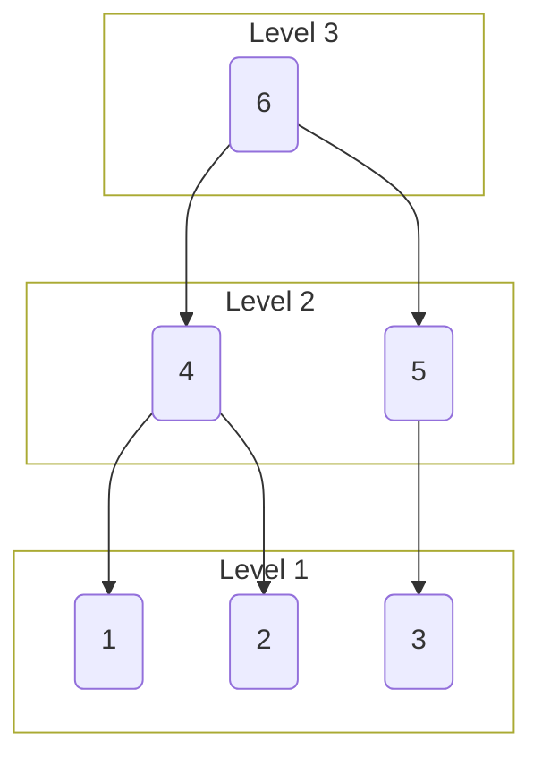

# Generated Tree

<details>
<summary> Parameters </summary>

- Leaves: 3
- Branches: 2
- Order: Descending
- Level Outlines: yes
- Table Representation: Horizontal (top-down)

```console
enary 3 2 -l -o examples/03x2:levels.md
```

</details>

<div align="center">

[Interactive View](https://mermaid.live/view#pako:eNptjTFvwyAQRv_K6YaKSM4A2BkYOkQduyVTSwcaztgSBsuGSlGU_16lppaadPt4J9674ClaQoVuMmMHx70OAHP-XJ6Ov2t8pS_ywDV-3G4Aczp7Aseh7b1XIQZaeOCMb8oUTPxOyeTPpGD_usXqFvdu8eCuWb2B7fYZAocnCKLghjUFy38bcm3I-4Z8aOzYrsjqW6MpRqxwoGkwvUWFF42po4E0Ko2WWpN90njFCk1O8XAOJ1RpylThFLPrULXGz1RhHq1J9NIbN5lhpaMJbzEOy5frNxiaeMQ)



</div>
