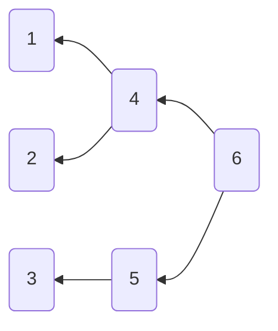

# Generated Tree

<details>
<summary> Parameters </summary>

- Leaves: 3
- Branches: 2
- Order: Descending
- Level Outlines: no
- Table Representation: Vertical (left-right)

```console
enary 3 2 -t v+ -o examples/03x2:vertical:inverted.md
```

</details>

<div align="center">

[Interactive View](https://mermaid.live/view#pako:eNo9yzsLwjAYheG_8nEGSaEOvQ4ZnByddJMsH216gSYpMRmk9L-LmLq9PJyzoXO9hsToeZ3oflOWiMgWoshSlqI8shLVkbWoMzqfL2QLOpEtEzeiSVwlaUWbpP4OG-Qw2huee0hsCmHSRitIhV4PHJegsCMHx-Aeb9tBBh91Du_iOEEOvLx0jrj2HPR15tGz-evK9umc-V32D5jrPwM)



</div>
