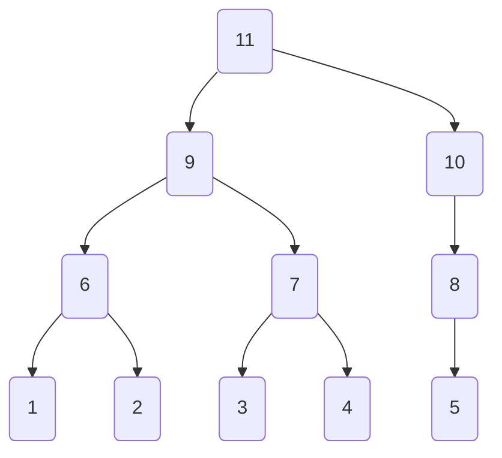

# Generated Tree

<details>
<summary> Parameters </summary>

- Leaves: 5
- Branches: 2
- Order: Descending
- Level Outlines: no
- Table Representation: Horizontal (top-down)

```console
enary 5 2 -o examples/05x2.md
```

</details>

<div align="center">

[Interactive View](https://mermaid.live/view#pako:eNo9zs1qwzAMwPFXEToMFVKI8x0fdhh7g-00fBGNmxRqO3j2YZS--wiTd_vzkwR64CUsFjWukfcNPt-MBwDwitRJsqGmZEttyY66kj31JQcaTnA-v4JX8AK-ER5pFG4P7oQnmoR7kZlmkeFYHMs3NalaBlMxRUqJzceyqrFCZ6Pj24IaHwbTZp01qA0u9sr5ngw-sULOKXz8-AvqFLOtMIa8bqivfP-2FeZ94WTfb7xGdv-6s_8Kwf2dPH8BxfdStw)



</div>
