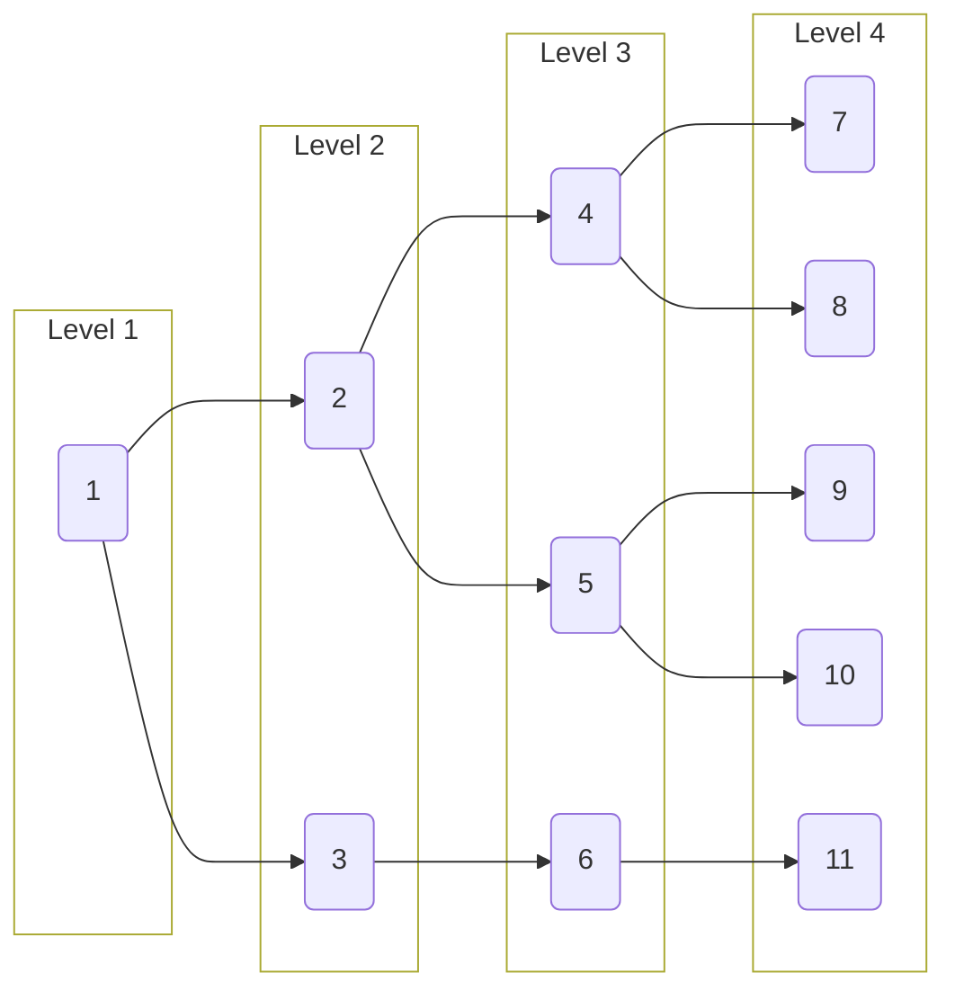

# Generated Tree

<details>
<summary> Parameters </summary>

- Leaves: 5
- Branches: 2
- Order: Ascending
- Level Outlines: yes
- Table Representation: Vertical (right-left)

```console
enary 5 2 -a -l -t v -o examples/05x2:ascending:levels:vertical.md
```

</details>

<div align="center">

[Interactive View](https://mermaid.live/view#pako:eNptzT1vgzAQgOG_Yt1QORKRODCfQ6aOmdqtdQc3HB-SMQhMpSjKf68oDlIh291r-Z4bXLqCIIdqUH3Nzm_SMDZO38taiU8JZ_ohzYSEr_mNsdFeNbEKWdlonZvO0NJNwpODG1OePsaMZ48RfY7-uiBH_FvIFP_VcFXDrRrsVMHFgR2PJ2YS9sJM6nLEI5ezOaPvesxj1xGf4sGKB1s83OEBD9w1MSuRyyEPXY6fGrgauDXEzkCO7lgwG6G7CB60NLSqKSCHmwRbU0sScgkFlWrSVsIdPFCT7d6v5gK5HSbyYOimqoa8VHokD6a-UJZeG1UNql1rr8xH17XLl_svC3WgAg)



</div>
