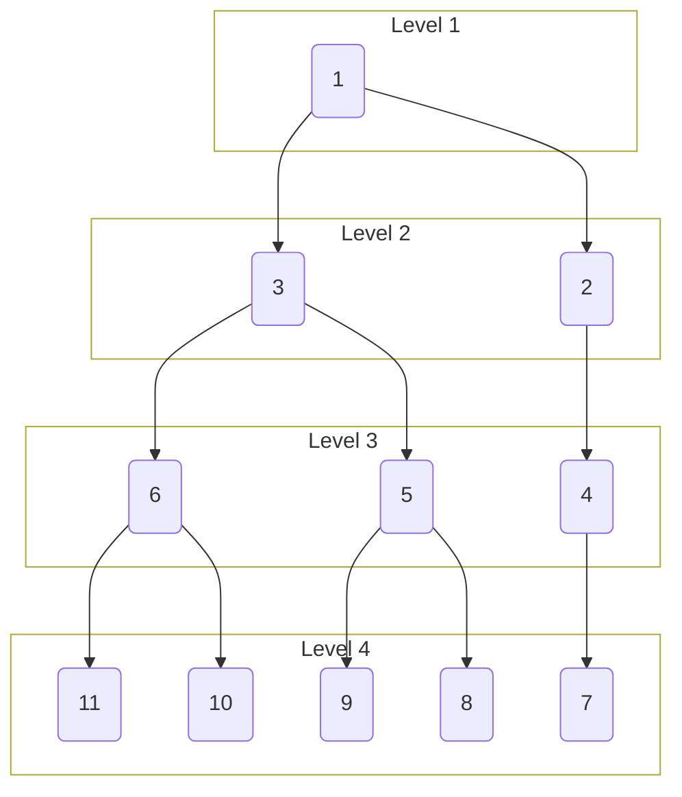

# Generated Tree

<details>
<summary> Parameters </summary>

- Leaves: 5
- Branches: 2
- Order: Ascending (Reversed)
- Level Outlines: yes
- Table Representation: Horizontal (top-down)

```console
enary 5 2 -a -r -l -o examples/05x2:ascending:reversed:levels.md
```

</details>

<div align="center">

[Interactive View](https://mermaid.live/view#pako:eNpt0D1rwzAQBuC_Im4oCjgQ2fLnkKF07NZOrTqo8fkDZMnYViGE_PeiWjbUzvbee-ge0A0upkQooB5k35D3Z6EJGe33PNb8U8Ar_qAiXMCX2xEyTleFpGakapUqtNE495oxythhGU6UnZYhp_kSM5otMaXpX0Rd_lejVY22arhTE5ocyPF4dj55crBfxDT2i9z1ma855b5OH-LhiodbPNrhEY38scQZsa9DGvqaPzTYarCtwfffSpk_Fjkj9BchgA6HTrYlFHATMDXYoYBCQImVtGoScIcApJ3M21VfoJgGiwEMxtYNFJVUIwZg-1JO-NLKepDd2vZSfxjTzU_uv_CUn_o)



</div>
