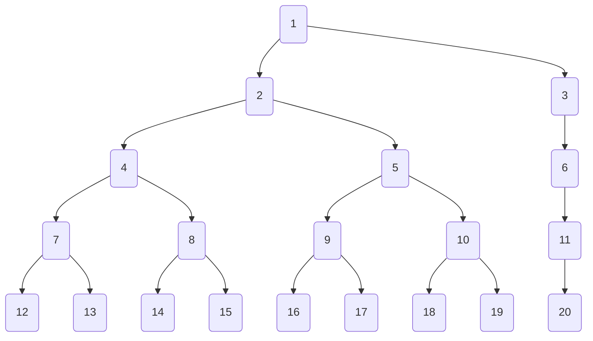

# Generated Tree

<details>
<summary> Parameters </summary>

- Leaves: 9
- Branches: 2
- Order: Ascending
- Level Outlines: no
- Table Representation: Horizontal (top-down)

```console
enary 9 2 -a -o examples/09x2:ascending.md
```

</details>

<div align="center">

[Interactive View](https://mermaid.live/view#pako:eNo9j8tqwzAQRX9FzKJMwAGPbOu1yKL0D9pV8UbEih2IH6j2ooT8e7Gr0fLcM5o7esJ17gI46KNfBvH13k5CCDGRRJInhgqpylAj1RkapCaDQlIZNJLOYJBMBotkGWSJsmTQqE_ifL7s9eJt703CoGFRH6JJwqJloQ6huaREKlmZQ1lWhERJyTKFNdYp0vuwSXGDTYrtsYPHFSpeTvwTlCk6TuQLK6xSrLgfc_s-WEEBY4ijv3fg4NnCOoQxtOBa6MLNb4-1hRcU4Ld1_vydruDWuIUC4rz1A7ibf_yEAral82v4uPs--jGni5--53n8f_L6A4Haeak)



</div>
