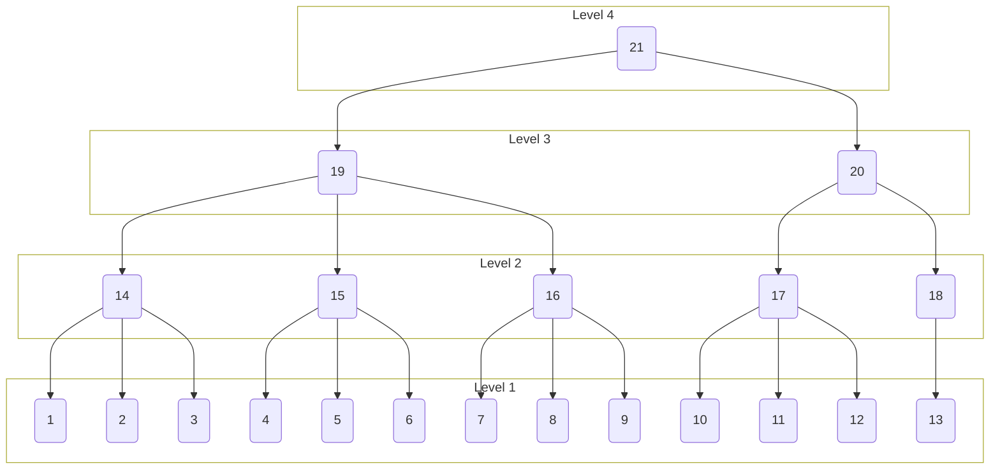

# Generated Tree

<details>
<summary> Parameters </summary>

- Leaves: 13
- Branches: 3
- Order: Descending
- Level Outlines: yes
- Table Representation: Horizontal (top-down)

```console
enary 13 3 -l -o examples/13x3:levels.md
```

</details>

<div align="center">

[Interactive View](https://mermaid.live/view#pako:eNptkMtqwzAQRX9FzKJMwAGPJD8XXZQuu2tXrbpQY9kJ2HJw7EII-ffixxiaZDNc6YzmztUFdm3hIIeqs8e9-HgxXojT8DMfK_oy8OZ-XS3IwPfIhDj159qJikR5qOvct97N956QNouUKFkqVCw1apYRRixjjFkmmLBMMWWZYcaSQqRwPRDS6kgSafUkhTS7Ol_8TyTXRPI2kbxPpJH0Rmy3z8KTeBJejkUxjZCiheoRRGOJmcZI8UKTEaRjyZgmSAlPDkdCkwFJbkiRUm5QD6OoNYq6jaLuo2RIGc-btqVpXeJ9ZYgy5IZpYUof2urVVt_a6jtbSSiJp2bTF4bLVAigcV1jDwXkcDHQ713jDOQGClfaoe4NXCEAO_Tt-9nvIO-7wQXQtUO1h7y09ckFMBwL27vXg60626y3R-s_27aZn1z_AO50yTk)



</div>
