# Generated Tree

<details>
<summary> Parameters </summary>

- Leaves: 50
- Branches: 5
- Order: Ascending
- Level Outlines: no
- Table Representation: Horizontal (top-down)

```console
enary 50 5 -a -o examples/50x5.md
```

</details>

<div align="center">

[Interactive View](https://mermaid.live/view#pako:eNo908tq3EAQBdBfEb0I1zAG1aP1WngR8gfJKsxGeOQZgyUNirQIxv8epqsqu-IW0unbQp_pdb1MaUjXbbzfql_fz0tVLQR6KgODbRCIDQq1ISPb0KCxoUVrQ4fOhh69DVSDah8J5G8nBvn7SUAukILcoAxyhRqQO9SCXKIO5Bb1INe4BrvGBI4uDHaNBewaK9g1zmDXuAG7xi24faqen1-qhapv1cIWd-DOY3nEanEP7j3Oj7ix66shtcftI-4sJgh53D9iqi1nCIdZUDJVBCKxKCyZKwrRWBSYXM6QHItCk9sNpIlFwdnxFhKF2Ro73kGiMhecHe8hUZoLzoZrDY3aXHA2XAkaxbngYrgyNJpLwcVwFWg0l4KL4arQaC4FF8czNJpLwcXxBhrNpbeohUZnrcvnJFt00OisXBZiix4anVXLItt_USNHZ7WTZEKOtlpOonaSzMjRVss1ZLuGLMjRNpdryJxOaZ62eXy_pCF9ntN-m-bpnIZzukxv4_Gxn9NXOqXx2Neff5fXNOzbMZ3Sth7XWxrexo8_0ykd98u4Tz_ex-s2zv_T-7j8XtfZHvn6ByNE-do)

```mermaid
graph TB
    n14(14)
    n15(15)
    n16(16)
    n17(17)
    n18(18)
    n19(19)
    n20(20)
    n21(21)
    n22(22)
    n23(23)
    n24(24)
    n25(25)
    n26(26)
    n27(27)
    n28(28)
    n29(29)
    n30(30)
    n31(31)
    n32(32)
    n33(33)
    n34(34)
    n35(35)
    n36(36)
    n37(37)
    n38(38)
    n39(39)
    n40(40)
    n41(41)
    n42(42)
    n43(43)
    n44(44)
    n45(45)
    n46(46)
    n47(47)
    n48(48)
    n49(49)
    n50(50)
    n51(51)
    n52(52)
    n53(53)
    n54(54)
    n55(55)
    n56(56)
    n57(57)
    n58(58)
    n59(59)
    n60(60)
    n61(61)
    n62(62)
    n63(63)
    n4(4) --> n14 & n15 & n16 & n17 & n18
    n5(5) --> n19 & n20 & n21 & n22 & n23
    n6(6) --> n24 & n25 & n26 & n27 & n28
    n7(7) --> n29 & n30 & n31 & n32 & n33
    n8(8) --> n34 & n35 & n36 & n37 & n38
    n9(9) --> n39 & n40 & n41 & n42 & n43
    n10(10) --> n44 & n45 & n46 & n47 & n48
    n11(11) --> n49 & n50 & n51 & n52 & n53
    n12(12) --> n54 & n55 & n56 & n57 & n58
    n13(13) --> n59 & n60 & n61 & n62 & n63
    n2(2) --> n4 & n5 & n6 & n7 & n8
    n3(3) --> n9 & n10 & n11 & n12 & n13
    n1(1) --> n2 & n3
```



</div>
